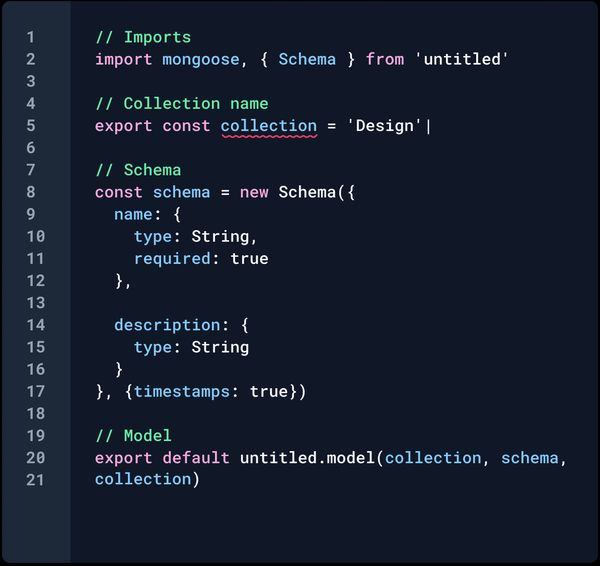

## Coding Standards
When I first was introduced to coding standards, I believed it was common practicies like indenting, naming variables with different conventions to make your code more readable for other people. While all these practices may seem trivial, I discovered that coding standards are much more than just simple comsmetic style guides. On software engineering projects, these coding standards are the backbone in writing consistent, maintainable, and understandable code.

## First Impressions of ESLint
After my first week of using ESLint and VSCode, I've really started to appreciate how coding standards are not only making your code neat, but also teaching you dicipline in programming. At first, I was getting frustrated at ESLint for flagging minor errors and for issues that did not feel important. Things like small spacing issues or missing semicolons that did not affect the functionality of the program felt tedious to fix and taking time away from the "real work" of solving the problems. However, I came to realize that ESLint will form habits for me to make my code readable for not only other collaborators, but myself when trying to remember old code. 

## Coding Standards as a Learning Tool
I believe the single most important thing I've learned from this module is that coidng standards help me better understand the language. For example, ESLint detects undeclared variables, missing returns or incorrect scoping which are things that can pass and create bugs later on. Overall in the long term, creating code that follows these guidelines will save developers time and better understand the language to reduce the possibility of bugs or unsafe code. Although I have only been using these tools for a week, I can see how I am actively correcting my code and making fewer mistakes, writing cleaner code with good style. 

## Conclusions
Overall my experience using tools like ESLint and VSCode has helped me understand that coding standards are painful, but also necessary. They may seem to get in the way of making progress in writing code, however it does the opposite by ultimately making your code more understandable, stable, and professional. More importantly, they have made me think more about how I write programs and have made me write cleaner code. Coding standards instill good habits that all software engineering projects require and which all others are based.
