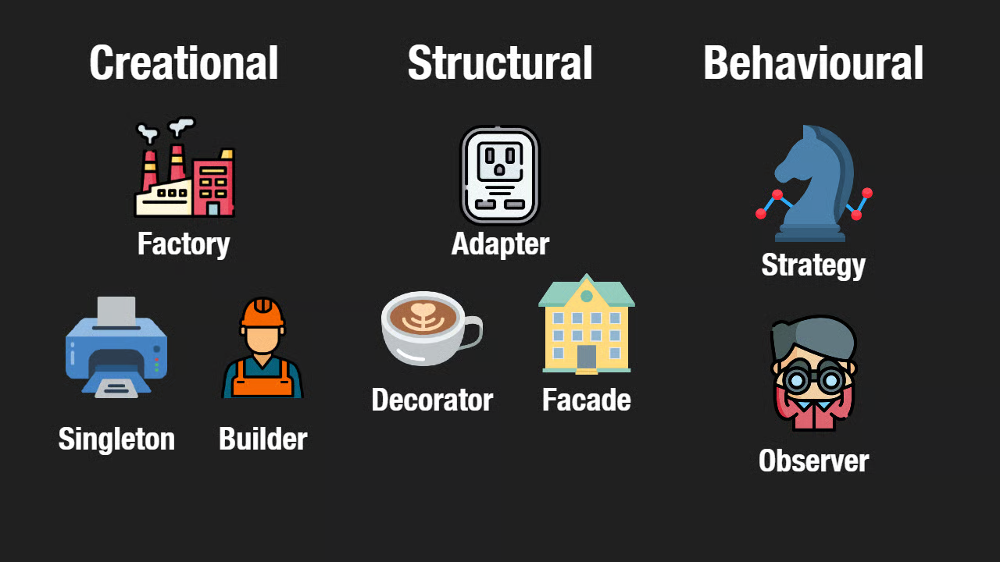

## Finding the Paths in the Maze
Building Manoa-Guesser sometimes felt like navigating the UH Mānoa campus for the first time. There are countless ways to get from one building to another, but only a handful of paths reliably get you where you need to go without confusion. In software engineering, those well-worn paths are called design patterns: proven ways of structuring code that developers return to again and again because they reduce complexity and increase clarity. They are not rigid rules or templates, but reusable mental blueprints for solving recurring problems in system design. When developers talk about design patterns, they are really talking about shared solutions, a common language that allows engineers to describe complex systems simply by saying, “This part behaves like a factory” or “That logic follows a strategy.”

## When Patterns Start Appearing in Real Code
As our project Manoa-Guesser evolved from a simple concept into a complete web application with authentication, persistent data, and dynamic gameplay, I began to notice these patterns emerging naturally. Our authentication system, implemented with NextAuth, resembles a Factory pattern. The credentials provider encapsulates the complicated logic of verifying a user and generating a session object, while the rest of the application receives a clean, consistent result without needing to understand the internal process. Like ordering from a restaurant kitchen, the client asks for a result and receives it—without ever needing to know how it was prepared.

## Swapping the Rules Without Rewriting the Game
The game mechanics demonstrate another important pattern: Strategy. Scoring algorithms and distance calculations are written in a way that allows them to be swapped out without changing the rest of the application. Whether the game measures success by time taken, distance guessed, or accuracy percentage, the UI remains unchanged. Each scoring function behaves like a plug-in, the game simply inserts a different “strategy” depending on how it wants to evaluate the player. This flexibility lets the system grow without forcing a rewrite of the surrounding code, proving why design patterns are as much about future-proofing as they are about structure.

## Code That Listens and Responds
Meanwhile, React itself quietly applies an Observer pattern throughout the project. When a player makes a guess, the state updates—and automatically, the map, score, timer, and interface refresh in response. Components “listen” for changes and react accordingly, without needing direct communication between each other. This reduces coupling, making the application easier to extend and debug, and it reinforces the idea that design patterns are often embedded in the tools developers use, even when they are not explicitly labeled.

## One Reliable Gatekeeper
On the backend, Prisma behaves like a Singleton, ensuring only one database client instance is created during development and runtime. This avoids wasted resources, prevents connection conflicts, and guarantees consistency across database access. Rather than opening a new line of communication every time data is needed, the application relies on a single trusted gateway—like a receptionist who knows every visitor and every room.

## Why These Patterns Mattered
By the time Manoa-Guesser was complete, it became clear that design patterns were not abstract classroom concepts but practical tools guiding real decisions. Factory simplified authentication, Strategy shaped gameplay, Observer controlled interface behavior, and Singleton stabilized database access. These patterns didn’t just make development easier—they made the final product cleaner, more reliable, and easier to maintain. Much like learning the shortcuts around campus, understanding design patterns didn’t just help me get to the destination. It changed how I traveled entirely, turning a maze of possibilities into a system that made sense.

Grammar and format done with the assitance of ChaTGPT
