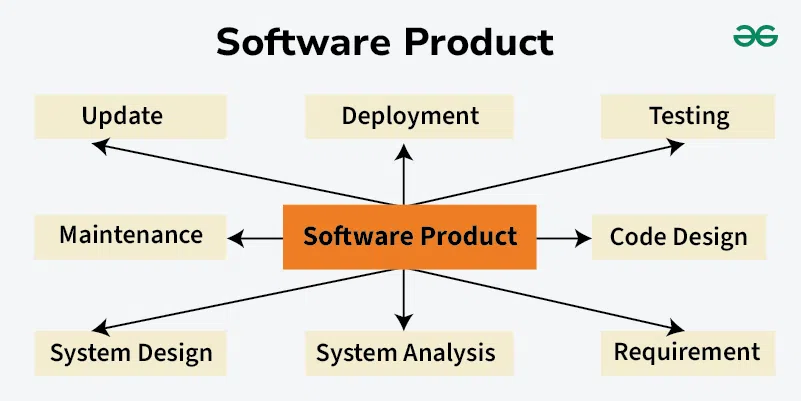

## Reflecting on Software Engineering
As I near the end of this course, I’ve come to realize that ICS 314 was not really about learning how to build web applications but was more about learning how software is engineered in real-world environments. Through working in teams, managing evolving codebases, and coordinating development over time, I gained exposure to software engineering concepts that extend far beyond any specific technology stack. One of the most impactful lessons from this course was understanding how software can be developed collaboratively and sustainably. In particular, the topics I took away most was Configuration Management, Agile Project Management, and Coding Standards which reshaped how I think about building software in any context.

## Configuration Management
Configuration Management is the practice of systematically tracking, controlling, and maintaining changes to software over time. This includes managing versions of code, dependencies, and development environments to ensure consistency across different systems and team members. In ICS 314, configuration management showed up through the use of Git, GitHub workflows, and dependency management tools. I learned that without proper configuration management, even well-written code can become unreliable or difficult to maintain. These ideas apply far beyond web development. For example, in my other projects and work on embedded systems, it is important to ensure that everyone is working with the same configurations and versions to have reproducibility and long-term maintainability. This course made it clear that configuration management is essential for scaling software projects and preventing chaos as systems grow more complex.

## Agile Project Management
Agile Project Management is an approach to organizing work that emphasizes adaptability, frequent feedback, and incremental progress. Instead of planning everything upfront, Agile focuses on breaking work into small tasks that can be completed and evaluated quickly. In this course, we used a specific form of Agile called Issue Driven Project Management, where work is organized around clearly defined issues that describe features, bugs, or improvements. Each issue has a scope, priority, and expected outcome. When doing this approach on our final project, I found that it encourages continuous progress and makes large projects feel manageable. I can easily see myself applying this style of project management to my other team coding projects. The same principles of incremental progress, accountability, and flexibility would still apply. This course showed me that Agile is not tied to any specific technology, but rather to how people work together to solve complex problems.

## Coding Standards
Coding standards are a shared set of rules and conventions that guide how code is written and organized. These standards cover aspects such as naming variables and functions, structuring files, formatting code, and handling errors. What stood out to me was how coding standards improved readability. When everyone follows the same conventions, it becomes much easier to understand someone else’s code without extensive explanation. This is important not just for web development, but for any long-term software project. Whether working on a backend service, a mobile application, or a systems-level project, consistent coding standards make it easier for new contributors to onboard and for existing contributors to modify code safely. Another key lesson was how coding standards support correctness and maintainability, not just aesthetics. Many ESLint rules exist to catch potential bugs, such as unused variables, accidental global variables, or inconsistent return values. In this sense, coding standards act as an additional safety net that helps catch mistakes early.

## Conclusion
Overall, ICS 314 taught me that software engineering is about much more than building applications that work. It is about designing systems that can evolve, collaborating effectively with others, and managing complexity over time. The concepts of open source development, configuration management, and agile project management are foundational skills that apply to nearly every area of computing. This course helped me move beyond thinking of software as just code, and toward understanding it as a long-term, collaborative engineering effort.
