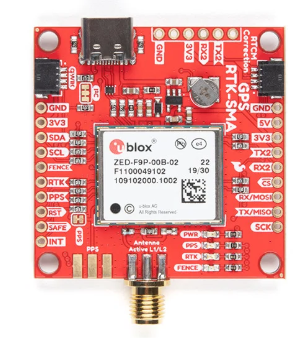
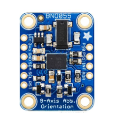
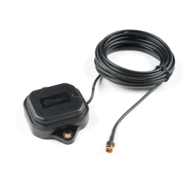
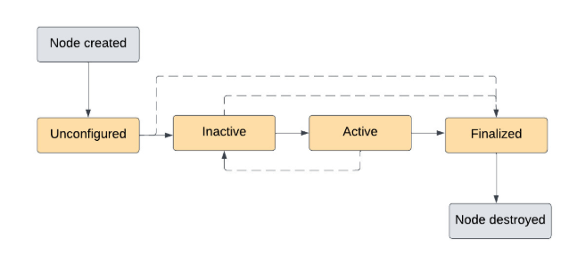
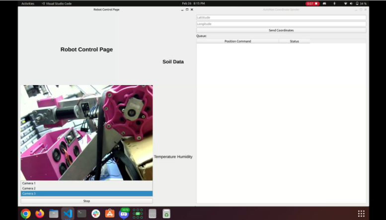
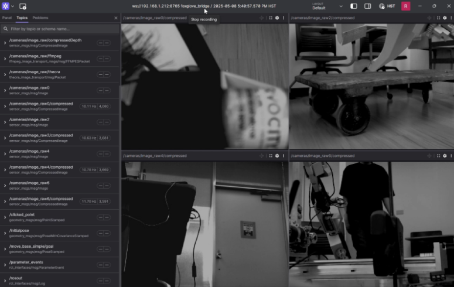

## Summary

In my third semester on Team Robotic Space Exploration (RoSE) as a member of the Guidance, Navigation, and Control (GNC) subteam, I contributed to improving the functionality of our robot, mainly the ground station graphical user interface and localization. This semester, I focused on implementing ROS2 lifecycle nodes, enhancing the ground station GUI for better usability, finalizing our high-precision localization using RTK fused with IMU data through an Extended Kalman Filter, and integrating Foxglove Studio for better observability of camera feeds and data analysis of ROS2 data. Each of these tasks offered its own challenges and learning opportunities, and have significantly improved both the capabilities of our robot and my skills as an engineer. This report details my contributions and lessons learned over the Spring 2025 semester as a part of Team RoSE.

## Localization Enhancement with RTK and IMU Sensor Fusion

Accurate localization is essential for autonomous robotics, and our team’s efforts to improve it continued this semester. Building on the initial Real-Time Kinematics (RTK) work from previous terms, I finalized our localization system that fuses GNSS data from ZED-F9P modules (shown in figure 1) with the BNO055 (shown in figure 2) IMU data using an Extended Kalman Filter (EKF). To receive GNSS signals, we combined each ZED-F9P module with a L1/L2 antenna (shown in figure 3)
We configured one ZED-F9P as a base station and the other on our rover as the receiver, enabling ~10 centimeter-level positioning accuracy. While RTK alone offers impressive positional data, it’s prone to occasional signal dropout or multipath errors. To make our localization system robust to such issues, I integrated IMU data (accelerometer and gyroscope) to estimate the rover's position and orientation.
The sensor fusion was implemented using an EKF node within ROS2, which required careful tuning of parameters such as process noise, measurement noise, and initial covariance. We performed several field tests to evaluate the fused solution. The results showed that the system maintained accurate pose estimates even during temporary RTK dropouts or GNSS signal degradation. 

## ROS2 Lifecycle Node Integration
One of my first assignments this semester involved working with ROS2 lifecycle nodes. ROS2 introduced lifecycle nodes to help manage the state of a node in a more controlled and safe manner which would especially be useful for our ground station. Unlike standard ROS2 nodes, lifecycle nodes support well-defined states such as unconfigured, inactive, active, and finalized. This was especially relevant for our ground station, where we previously had to rely on manually launching and killing nodes using terminal commands.
I began by researching ROS2 lifecycle node APIs and examining pre-existing code found in the ROS2 tutorials for lifecycle nodes. After gaining a solid understanding, I refactored a number of our existing ROS2 nodes to adopt this lifecycle model. This included the usb_camera node running on a Raspberry Pi. Previously, this node required a hard manual shutdown using Ctrl+C, which was not plausible with multiple nodes running on the ground station. Therefore, I redefined this node to transition cleanly between states, allowing it to be started, paused, or shut down programmatically from the ground station GUI.
Integrating lifecycle support not only improved safety and modularity but also allowed us to add a clean startup and shutdown procedure. This was crucial during field tests, where improper shutdowns could cause hangs, device locks, or data corruption. The ability to cycle nodes through different lifecycle states also set the foundation for better fault recovery, system health checks, and future support for autonomous fault tolerance.

## Ground Station GUI Development and Automation
This semester saw significant improvements in our ground station GUI, which I had begun developing in previous semesters using the Qt framework. Initially a proof-of-concept, the GUI is now an integral part of the operator workflow, supporting real-time telemetry monitoring, process control, and system feedback.
My first enhancement was the implementation of a launch manager within the GUI. I added logic to allow users to launch entire ROS2 packages or specific nodes with a single button click. Each button was tied to launch files using subprocess management in Python, and the GUI was updated to provide visual feedback via text logs on the success or failure of each command.
Additionally, I implemented SSH-based remote launch capabilities. This allowed us to trigger ROS2 nodes or scripts on remote computers, such as Raspberry Pis mounted on the rover, from the ground station interface. The SSH interface used passwordless public key authentication and executed startup commands on the remote device, enabling us to manage a distributed ROS2 system from one central GUI.

## Foxglove Studio for Visualization and Debugging
To further enhance our system’s observability, I introduced Foxglove Studio which is a powerful platform for real-time data visualization and analysis. It provides a modern interface for inspecting topics, services, and messages in a ROS2 environment.
I installed and configured the Foxglove bridge node, which acts as a WebSocket interface between ROS2 topics and the Foxglove Studio client. Once this was running, we could visualize data such as live camera feeds, IMU readings, GPS coordinates, and EKF pose estimates.
Foxglove proved invaluable for debugging. In the future, I plan to integrate Foxglove more tightly with the ground station GUI, allowing users to launch it directly from the interface or toggle key visualizations based on mission phase.

## Conclusions and Future Plans
This semester, I gained hands-on experience with industry-standard software engineering tools and practice. I learned how to break complex problems into manageable tasks, validate through testing, and write maintainable code in a collaborative environment. I also got better at communicating technical details with team members across subteams, ensuring our software aligned with broader project goals. 
Looking ahead, I plan to build on this semester’s foundation by tackling more advanced tasks. One major area I want to explore is building a mission control framework using ROS2’s lifecycle and parameter servers. This system would coordinate all subsystem nodes like localization, navigation, communication, and telemetry with a central state machine, improving fault tolerance and mission reliability.
Additionally, I aim to enhance the ground station GUI by adding features such as:
Map view with GNSS overlays and planned trajectory
EKF diagnostics panel showing sensor health and fusion confidence
In the future, I hope to continue contributing to making Team RoSE’s software more autonomous, scalable, and user-friendly as a part of the GNC subteam. I also hope to improve my communication and collaboration skills as a lead to contribute to a better team environment and gain professional industry skills.
