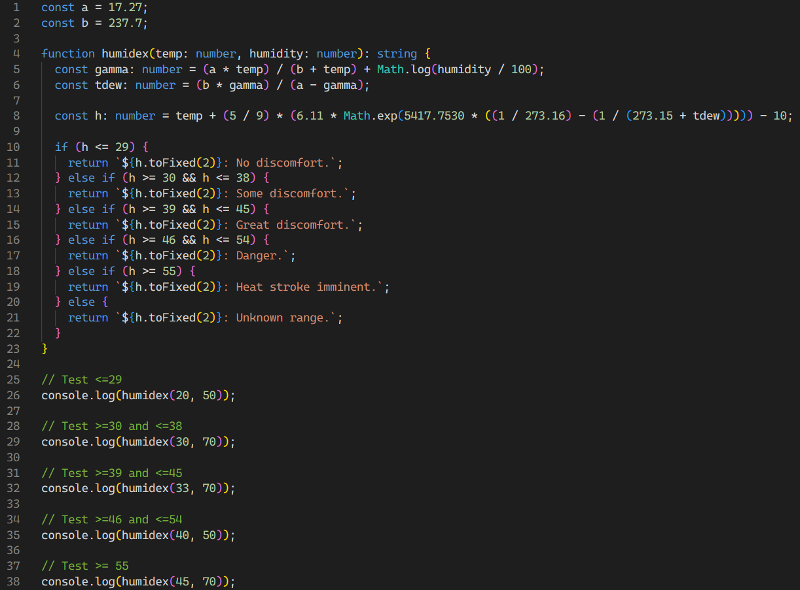

## Discovering TypeScript
Before starting this module, I had no prior experience using TypeScript. I mainly used Python and C++ in previous programming projects working with hardware for robotics applications. At first, it seemed like TypeScript was fairly similar to that of C++ in terms of writing functions and syntax. For the first WODs, I found myself defaulting to writing in C++ syntax and having to search up how to properly define functions and variables:

## TypeScript Through a Software Engineering Lens
I think TypeScipt is a good level up from JavaScript as it addresses the lack of type safety. When reading about the differences, I found out that bugs may appear at runtime in JavaScript, but could be caught earlier in the compilier if you instead used TypeScript. Looking at these differeneces and having worked on multiple file projects in C++ and Python, I now better understand how different languages offer more or less flexibility and safety depending on the use case of the software. For me, at least in the beginning, I found that TypeScript had a realtively large learning curve and had more steps to writing code than Python and even C++ at times when doing the WODs which were similar problems I had solved in different languages.

## Athletic Software Engineering: WODs
Beyond TypeScript, this module introduced me to athletic software engineering which I thought was extremely helpful. Getting consistent practice through the WODs gave me structure and hands-on experience to build fluency in TypeScript and also give me goals to work under time constraints. Since I had not done this before, the time exercises felt stressful, where I do not tend to perform as well. However, I believe that it an accurate reflection of real world demands and helps you get better at developing software. This is also helpful as it is similar to coding questions found on LeetCode which are commonly used to interview candidates for software engineering roles, which I plan on doing in the future. Overall I think it is extremely helpful to have goals and time constraints and consistent practice using the language through WODs.

## Final Thoughts
In summary, TypeScript feels like a language slightly more complicated to those I have been using like C++ and Python, but is important for developing software for thinks like web development which I do not have experience in, but am interested in learning. The athletic software engineering framework although stressful at first seems like the ideal way to develop programming skills and prep for software interviews for jobs. 

Next up? Expanding our mission control framework so lifecycle nodes, parameter servers, and the GUI work together like a true ground-to-space system. Because one day, this rover might not just be rolling across a lawn in Hawai‘i — it could be part of something that rolls across Mars.  
