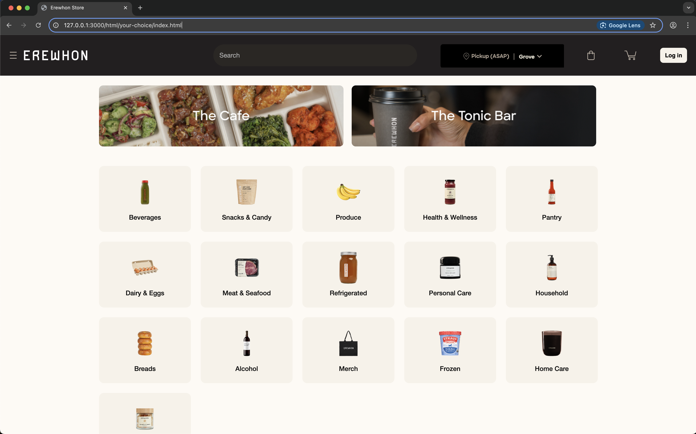

## First Impressions of UI Frameworks
Starting off with no experience in web design, I had not written a single line of HTML and CSS code. When initially working with UI frameworks like Bootstrap 5, it seemed like an overly complicated toolkit that added even more things to keep of all the HTML tags and CSS styling. However, as I had to create more complex websites, mimicking actual businesses, I found it extremely helpful to use a UI framework. It saved a lot of time and effort with the grid system, responsive utilities, and pre-built components. Although it would be possible to adjust the website by making multiple changes in the CSS file, the framework made it a lot easier to get the tweaking right with less effort. When initially looking at the documentation and classess, it seemed very intimidating, almost as if I had to learn a whole new programming language. However, as I got more familiar with the framework, the naming conventions and layout began to click more. 

## Is Bootstrap 5 Worth It?
The biggest upside to Boostrap 5 is how efficient it can make designing websites. Even though I have not spent a lot of time using this framework, I have already became a lot more efficient at building complete UIs with things like navigation bars, cards, and buttons in minutes. The elements in Bootstrap 5 are also very customizable, allowing developers to maintain creativity, but also accelerate their process in designing a good looking, interactive UI. Similar to coding standards, Bootstrap ensures you have design discipline as a developer. It makes sure your have organized HTML structure, use semantic elements, and follow accessiblity practicies. Below is an example of a website I recreated using Bootstrap 5.

## Comparing Frameworks and Raw Code
Before being introduced to frameworks, I found it extremely tedious to tweak the raw HTML and CSS code to get the UI exactly how I wanted it. While this gives you a lot of control, it also means that you have to comeup with everything for your project practically from scratch. I have not been able to try out other frameworks, however I have read that other frameworks have certain advantages and disadvantages compared to Bootstrap. For example, Semantic UI has very readable class names, but is less flexible and has less documentation for how to use iot. Bootstrap's ecosystem has a strong community, set of tutorials, and extensions that make me want to keep using it over other framwrosk as it is always adopting.

## Conclusions
Learning a UI framework like Bootstrap 5 has completely changed the way I am able to design websites. Although it initially seemed like an additional layer of complexity to my newly learned HTML and CSS skills, it has now become an indispensable tool that made designing more efficient. UI frameworks aren't only just to make your websites look good, but also embody good software engineering principles. Further using UI frameworks will undoubtedly improve my front-end design workflow at a faster rate than just learning raw HTML and CSS. 
