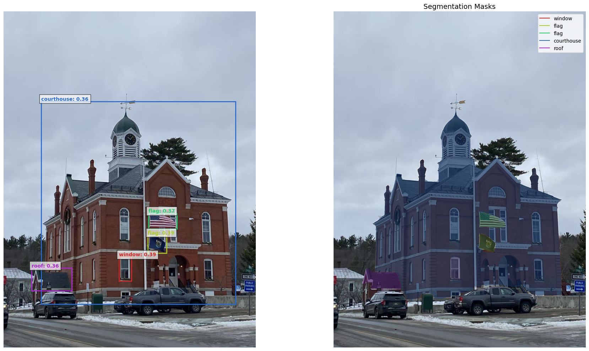
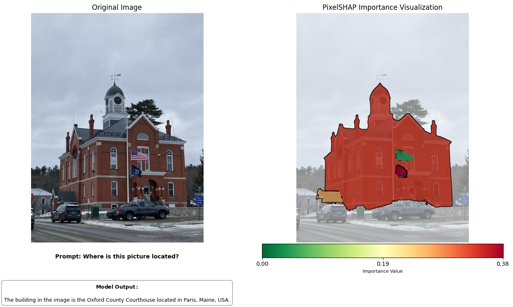

  
  

**Project overview.** GeoShield is a privacy-preserving pipeline that measures and mitigates geolocation leakage from images. I combined **DINO** feature embeddings, **SAM2** segmentation, and **PixelSHAP** attributions to quantify the importance of *fine-grained visual cues* (e.g., distinctive skylines, storefront typography, vegetation patterns, transit signage) that a vision(-language) model uses to infer location. Guided by those importance scores, GeoShield generates **counterfactual edits** that selectively obscure high-risk regions—via blurring, inpainting, or texture substitution—while preserving overall scene semantics and downstream utility. The result is an *automated*, data-driven defense that substantially reduces geolocation confidence for models like **OpenAI’s o3** without rendering images unusable.

**My role & responsibilities.** I architected and implemented the end-to-end system:
- Built the **attribution stack** (Python/PyTorch): SAM2 to segment images into coherent regions; DINO to embed regions; **PixelSHAP** to compute per-segment contribution scores to the geolocation prediction.
- Integrated an **o3 model inference wrapper** to obtain model logits/confidence for candidate locations, enabling attribution against the actual decision boundary.
- Designed a **counterfactual optimizer** that selects a minimal set of high-risk segments under a “privacy budget,” applies targeted transformations, and re-queries the model to verify risk reduction.
- Added **utility constraints** (e.g., CLIP similarity, SSIM/LPIPS thresholds) so edits preserve overall content and visual quality for non-geolocation tasks (captioning, object detection).
- Produced evaluation scripts, ablations (segment granularity, edit types, budget), and visual dashboards for before/after attribution maps and confidence scores.

**What I learned.** This project taught me how **interpretability can drive practical privacy defenses**: Pixel-level attributions make it possible to *surgically* intervene where risk is concentrated instead of applying coarse global blurs. I also learned to balance **privacy–utility trade-offs** by formalizing edit budgets and similarity constraints; small, well-placed counterfactuals often outperform heavy-handed redactions. Finally, working with segmentation, attribution, and model APIs in one loop reinforced the importance of **reproducible pipelines**, robust calibration of SHAP scores, and thorough evaluation across image types (street-level vs. landscape) to avoid dataset-specific shortcuts. GeoShield is a step toward **transparent, user-controllable protections** against location inference—showing how modern vision tools can be combined to both *explain* and *mitigate* model behavior.

*Status:* Under review for AAAI; preprint forthcoming.
You can check out my paper at the [2026 AAAI Conference](https://openreview.net/forum?id=ukS0ecYCDE).
