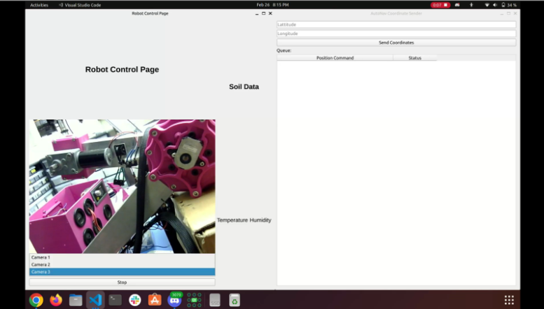
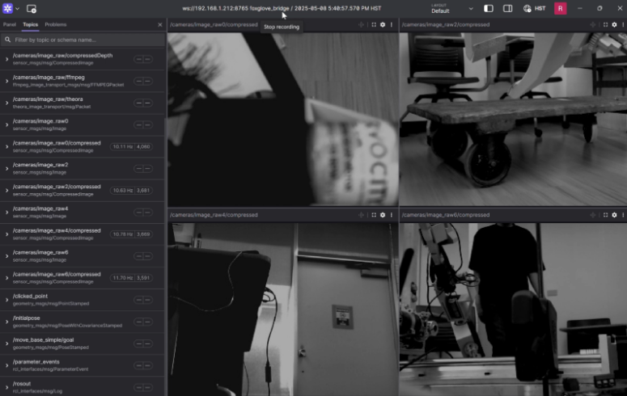

  
  

**Project overview:** Team Robotic Space Exploration (RoSE) is a student-led organization at the University of Hawaii that designs and builds autonomous rovers for simulated planetary exploration. Our rover was tasked with navigating unstructured terrain, detecting and localizing objects, and completing competition objectives with minimal human intervention. To succeed, the system required robust localization, perception, and planning pipelines that could adapt to uncertain and dynamic environments while maintaining real-time performance.

**My role & responsibilities:** As the Software Lead for the Guidance, Navigation, and Control (GNC) subsystem, I was responsible for architecting the rover’s autonomy pipeline and managing a subteam of 8-10 developers. My contributions included:
- **Sensor Fusion:** Fused RTK GNSS and IMU data using an Extended Kalman Filter, improving raw GPS coordinate accuracy from ~3 m to ~10 cm, enabling precise localization in outdoor environments.  
- **Path Planning:** Designed a SLAM-based planner that optimized shortest-path navigation while dynamically avoiding obstacles, increasing exploration coverage efficiency by ~40%.  
- **Computer Vision:** Integrated YOLOv8 object detection and ARUCO marker tracking, achieving ~90% detection accuracy in dynamic conditions and enabling reliable, real-time object localization.  
- **User Interface:** Developed a Qt-based UI to monitor rover status, manage ROS2 lifecycle nodes, and visualize sensor data, streamlining testing and operator oversight.  
- **Team Leadership:** Organized sprint goals, coordinated with mechanical and electrical teams, and led integration standups to manage cross-disciplinary dependencies and ensure alignment with project milestones.  

**What I learned:** Leading RoSE’s GNC subteam was as much about systems engineering and collaboration as it was about coding. I learned how to integrate diverse technologies—sensor fusion, SLAM, and vision—into a cohesive real-time autonomy stack, and how to balance accuracy with efficiency in resource-constrained environments. More importantly, I discovered the value of interdisciplinary teamwork: effective communication, expectation management, and agile planning were critical to overcoming hard.

2024 source code is not avaiable to the public yet.
[2023 source code](https://github.com/RoboticSpaceExploration/urc_gnc_autonav_ws)
